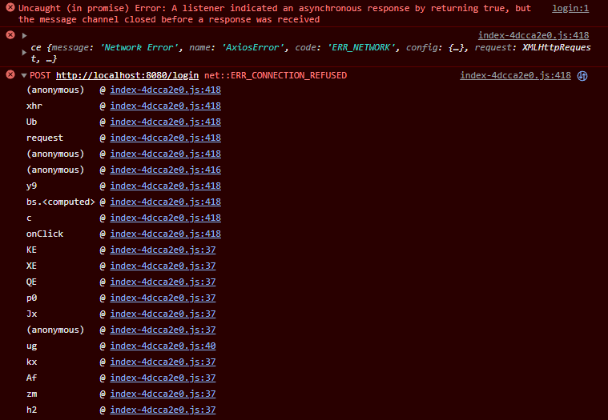
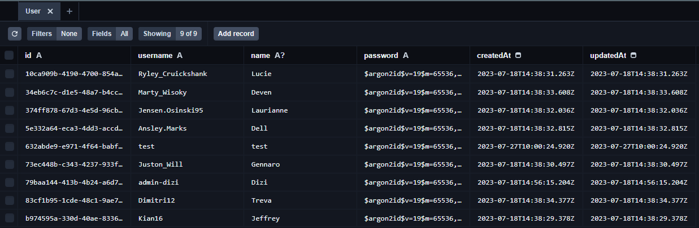
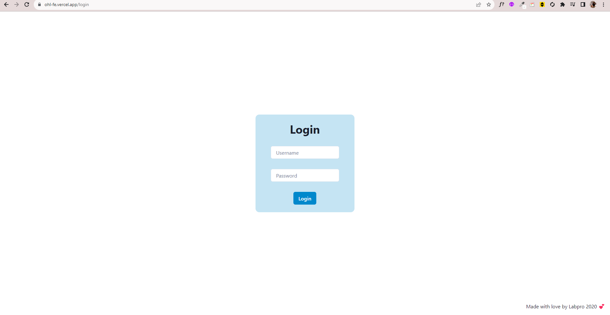
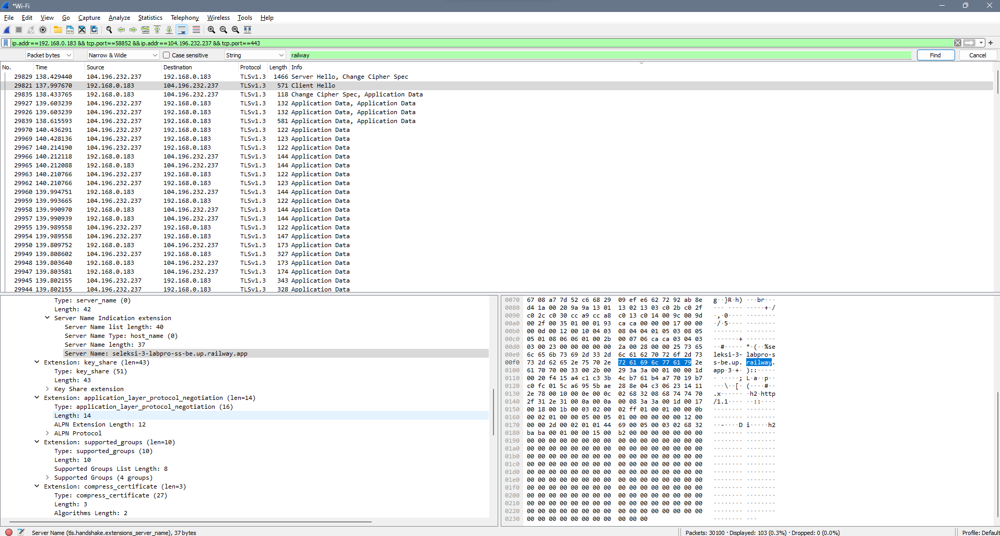
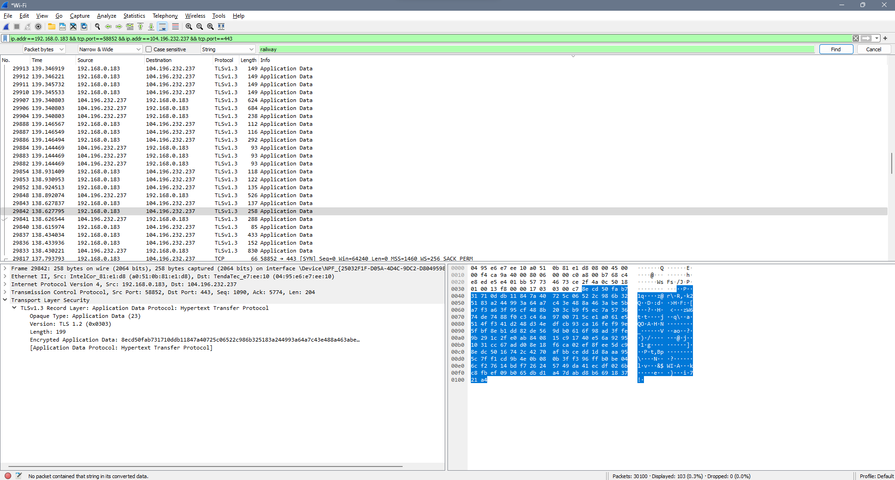
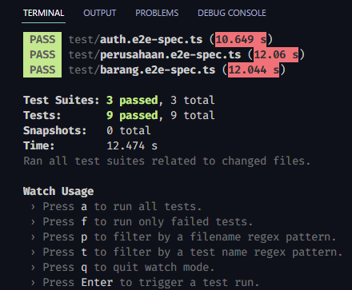

<h1 align="center">
  <br>
  <a href="https://github.com/DiziASP/seleksi-3-labpro-monolith">
    
  </a>
</h1>

<h4 align="center">A monolithic full stack website made with <s>Django</s>.</h4>
<p align="center"><sub > but this is the other backend :D<sub/><p/>

<p align="center">
    <a href="https://github.com/DiziASP/seleksi-3-labpro-ss-be/commits/master">
      
</p>

<p align="center">
  <a href="#about">About</a> •
  <a href="#installation">Installation</a> •
  <a href="#docker">Docker</a> •
  <a href="#tech-stack">Tech Stack</a> •
  <a href="#my-design-patterns">My Design Patterns</a> •
  <a href="#bonus">Bonus</a> •
  <a href="#license">License</a>
</p>

---

## About

<table>
<tr>
<td>
  
**BelanjaBelinji** SS-BE is single service backend for [BelanjaBelinji Monolith](https://github.com/DiziASP/seleksi-3-labpro-monolith). This project is made for the purpose of Seleksi 3 LabPro 2023.  This project is made using NestJS (TypeScript) and PostgreSQL. The reason why i use NestJS is because it implements Object Oriented Approach making it easier to implement **SOLID Principle**.


<p align="right">
<sub>(Preview)</sub>
</p>

</td>
</tr>
</table>

## Installation

### Prerequisites

* [Install](https://nodejs.org/en/download/) the latest version of **Node.js**
* [Install](https://www.npmjs.com/get-npm) the latest version of **NPM**
* [Install](https://www.postgresql.org/download/) the latest version of **PostgreSQL**

### Installation Steps

1. Clone the repository

    ```bash
    git clone https://github.com/DiziASP/seleksi-3-labpro-ss-be.git
    ```

2. Change the working directory

    ```bash
    cd seleksi-3-labpro-ss-be
    ```

3. Install dependencies

    ```bash
    npm install
    ```

4. Create `.env` file using `.env.example`

    ```bash
    # .env
    JWT_SECRET=<YOUR_SECRET_TOKEN>
    CLIENT_URL=<FRONTEND_URL>
    PORT=8080
    NODE_ENV=<development|production>
    CORS_WHITELIST=<CORS_WHITELIST_URL>
    DATABASE_URL=postgresql://<user>:<password>@<host>/<db>?schema=public
    DATABASE_HOST=<POSTGRES_HOST>
    DATABASE_USER=<POSTGRES_USER>
    POSTGRES_PASSWORD=<POSTGRES_USER_PASSWORD>
    POSTGRES_USER=<POSTGRES_USER>
    POSTGRES_DB=<POSTGRES_DB>
    ```

5. Generate Prisma Client and Migrate the database

    ```bash
    # generate prisma client
    $ npx prisma generate

    # migrate database
    $ npx prisma migrate dev
    ```

6. (If you want to seed the database) Seed the database using this command

    ```bash
    # seed database
    $ npx prisma db seed
    ```

7. Generate Secret Key for JWT

    ```bash
    # generate secret key
    $ npm run generate:key
    ```

    Copy the generated secret key and paste it to the `.env` file

    ```bash
    # .env
    JWT_SECRET=<GENERATED_SECRET_KEY>
    ```

8. Run the app

    ```bash
    # development
    $ npm run start

    # watch mode
    $ npm run start:dev

    # production mode
    $ npm run start:prod
    ```

9. You can manage your database by using `Prisma Studio`

    ```bash
    # open prisma studio
    $ npx prisma studio
    ```

    

    <p align="right">
    <sub>(Preview)</sub>
    </p>

## Docker

You can also run the application using Docker. Make sure you have Docker installed on your machine.

1. **[Clone this](https://github.com/DiziASP/seleksi-3-labpro-ss-be.git)** repository to your local machine.

2. Create a `.env` file in the root directory of the project. The `.env` file should contain the following environment variables:

    ```bash
    JWT_SECRET=<YOUR_SECRET_TOKEN>
    CLIENT_URL=<FRONTEND_URL>
    PORT=8080
    NODE_ENV=<development|production>
    CORS_WHITELIST=<CORS_WHITELIST_URL>
    DATABASE_URL=postgresql://<user>:<password>@<host>/<db>?schema=public
    DATABASE_HOST=<POSTGRES_HOST>
    DATABASE_USER=<POSTGRES_USER>
    POSTGRES_PASSWORD=<POSTGRES_USER_PASSWORD>
    POSTGRES_USER=<POSTGRES_USER>
    POSTGRES_DB=<POSTGRES_DB>
    ```

3. Build and Run the Docker Container using Docker Compose. Make sure your PostgreSQL server is not running on your machine.

      ```bash
      docker-compose up
      ```

4. Change the `DATABASE_URL` in the `.env` with the docker postgresql container instance and build it again using

      ```bash
      docker-compose up --build
      ```

5. Your docker is up and running. Open the website url `http://localhost:8000/` on your browser.

   

## Tech Stack

 
 
 

## My Design Patterns

* **[Singleton](https://refactoring.guru/design-patterns/singleton)**

    The Singleton design pattern is a software design pattern that restricts the instantiation of a class to one object. This is useful when exactly one object is needed to coordinate actions across the system. This pattern is used in this project on `JwtService` class. JWT class is global for the whole application and cannot be instantiated other than in the `app.module.ts` All you need to do is inject the class in the constructor of the class that you want to use.

    ```typescript
    // src/auth/auth.service.ts
    @Injectable()
    export class AuthService {
      constructor(
        private readonly usersService: UsersService, // Injected Class
        private readonly jwtService: JwtService, // Injected Class
      ) {}

      // ...
    }
    ```

* **[Dependency Injection](https://www.tutorialsteacher.com/ioc/dependency-injection)**

  Dependency Injection (DI) is a design pattern that allows the creation of dependent objects outside of a class and provides those objects to a class through different ways. Using DI, we move the creation and binding of the dependent objects outside of the class that depends on them. `@Injectable()` decorator in NestJS provides way to inject a class into another class.

* **[Chain of Responsibility](https://refactoring.guru/design-patterns/chain-of-responsibility)**

  Chain of Responsibility is a behavioral design pattern that lets you pass requests along a chain of handlers. Upon receiving a request, each handler decides either to process the request or to pass it to the next handler in the chain. This was used in the Interceptors and Filters because the catch a request in the middle of the transaction and process it before it reaches the controller and vice versa. Take a look at this `transform.interceptors.ts` file.

  ```typescript
  // src/interceptors/transform.interceptor.ts
  export interface Response<T> { // Response Interface
    status: 'success';
    message: string;
    data: T | null;
  }

  @Injectable()
  export class TransformInterceptor<T>
    implements NestInterceptor<T, Response<T>>
  {
    intercept( // Intercept the request
      context: ExecutionContext,
      next: CallHandler,
    ): Observable<Response<T>> {
      return next.handle().pipe(
        map((data) => ({ // Map the response with this format
          status: 'success',
          message: getReasonPhrase(
            context.switchToHttp().getResponse().statusCode,
          ),
          data: data || null,
        })),
      );
    }
  }
  ```

## Bonus

* **B01 - OWASP**
  
  * **Injection**
  
    One of the most common attack on web application is SQL Injection. SQL Injection is a web security vulnerability that allows an attacker to interfere with the queries that an application makes to its database. This is done by injecting SQL code into the database query.

    This project is protected from SQL Injection by using `Prisma` ORM. Prisma is a modern database access toolkit that allows you to access databases in a type-safe and efficient way using Prisma Client. And also NestJS provides `ValidationPipe` that can be used to validate the request body. This is used in the `app.module.ts` file. The `ValidationPipe` will validate the request body before it reaches the controller by using `class-validator` to check the body of the request in form of **Data Transfer Object (DTO)**.

    This is the scenario of the attack:

    Let's say we have a `User` model with `username` and `password` field. The attacker can send a request with a body like this:

    ```json
    {
      "username": "admin",
      "password": "' OR 1=1 --"
    }
    ```

    The attacker can login as admin without knowing the password. But thanks to `ValidationPipe` and `Prisma` ORM, the request will be rejected because the `password` field is not a valid password specified in the `login-auth` DTO.

    

  * **Crytopgraphic Failure**
  
    What happens when your very secret password is leaked? The attacker can use the password to login to your account. This is a cryptographic failure. To counter this, every login and register request will be hashed using `argon` before it is stored in the database.

    Take a look from this example scenario from OWASP:

    ```docx
    Scenario #3: The password database uses unsalted or simple hashes to store everyone's passwords. A file upload flaw allows an attacker to retrieve the password database. All the unsalted hashes can be exposed with a rainbow table of pre-calculated hashes. Hashes generated by simple or fast hash functions may be cracked by GPUs, even if they were salted.
    ```

    Let's say the attack somehow managed to gain access to the database. The attacker can see the password of the user. But the password is hashed using `argon` so the attacker cannot use the password to login to the user account (or maybe the can, but it will take a very very very long time to crack the password).

    

  * **Identification and Authentication failure**
  
    ```docx
    Scenario #3: Application session timeouts aren't set correctly. A user uses a public computer to access an application. Instead of selecting "logout," the user simply closes the browser tab and walks away. An attacker uses the same browser an hour later, and the user is still authenticated.
    ```

    This is a very common attack. The attacker can use the user's account without knowing the password. This is because the user didn't logout from the application. To counter this, the application will set the authentication token to expire in short period of time. After the token expire, the user will be logged out automatically.

    All of this can be set using `@nestjs/jwt` module. This is the configuration for the Token Signing Configuration:

    ```typescript
    async signToken(userId: string, username: string): Promise<string> {
      const payload = {
        sub: userId,
        username,
      };
      const secret = this.config.get('JWT_SECRET');

      const token = await this.jwt.signAsync(payload, {
        expiresIn: '30m', // Token will expire in 30 minutes
        secret: secret,
      });

      return token;
    }
    ```

* **B02 - Deployment**

    The application is deployed on railway. You can access the API [here](https://seleksi-3-labpro-ss-be.up.railway.app/).

* **B03 - Single Service Implementation**

    The single service is implemented using TypeScript. The configuration for the TypeScript are as follow:

    ```json
    // tsconfig.json
    {
    "compilerOptions": {
      "module": "commonjs",
      "declaration": true,
      "removeComments": true,
      "emitDecoratorMetadata": true,
      "experimentalDecorators": true,
      "allowSyntheticDefaultImports": true,
      "target": "ES2021",
      "sourceMap": true,
      "outDir": "./dist",
      "baseUrl": "./",
      "incremental": true,
      "strict": true,
      "skipLibCheck": true,
      "strictNullChecks": false,
      "noImplicitAny": true,
      "strictBindCallApply": false,
      "forceConsistentCasingInFileNames": true,
      "noFallthroughCasesInSwitch": false
      }
    }
    ```

* **B04 - Polling**

    Not Implemented.

* **B05 - Lighthouse**

    This bonus is implemented on the [monolith](https://github.com/DiziASP/seleksi-3-labpro-monolith).

* **B06 - Responsive Layout**

    This bonus is implemented on the [monolith](https://github.com/DiziASP/seleksi-3-labpro-monolith).

* **B07 - API Documentation**

    The API Documentation is available on the website's [API Documentation Page](https://seleksi-3-labpro-ss-be.up.railway.app/api).

    Implemented with [Swagger](https://swagger.io/).

* **B08 - SOLID Principle**

    The SOLID principle in this project are the following:

  * **S**ingle Responsibility Principle

    Some class in this project has a single responsibility. For example, the `AuthService` class has a single responsibility which is to handle the authentication process.

  * **O**pen-Closed Principle

    Some class in this project is open for extension but closed for modification. For example, the `NestInterceptor` interface are open for extension because it can be implemented to other classes such as `TransformInterceptor` but closed for modification because we don't need to modify the `NestInterceptor` interface at any way.

  * **L**iskov Substitution Principle

    Some class in this project can be substituted with its subtypes. For example, in the `UpdateBarangDTO` class the fields are actually comes from `CreateBarangDTO` class which is the parent of the UpdateBarangDTO class. We can actually use the `CreateBarangDTO` class to update the barang but we use the `UpdateBarangDTO` class instead because we don't need some of the fields and also `{ OmitType, PartialType }` enables the class to have optional fields.
  
  * **I**nterface Segregation Principle

    Some class in this project has multiple interfaces that are specific to the client. For example, `Barang` has entity interfaces `BarangEntity` that are specific to `Barang`. The `BarangEntity` interface is used to return the data to the client.
  
  * **D**ependency Inversion Principle

    Some class in this project depends on abstractions rather than concrete implementations. For example, the `AuthService` class depends on the `UsersService` class and the `JwtService` class. The `UsersService` class is an abstraction of the `Users` entity and the `JwtService` class is an abstraction of the `@nestjs/jwt` library.

* **B09 - Wireshark**

    Since the application is deployed on railway, the application is running on top of HTTPS. So, in theory the application payloads will be encrypted. This how i found out why it was encrypted:

    1. Let's say i want to login to Admin FrontEnd
    
    2. Then i open the wireshark and start capturing the traffic
    3. Then i login to the Admin FrontEnd. This is how i found the server name.
    
    4. Then i try to find the payload through the Handshake Protocol. And all i found is the Encrypted Application Data that should contains the payload. This also true for other application data that came or sent to the server.
    

    In conclusion, the application payload is encrypted hence the connection is secure thanks to HTTPS and TLS. The payload cannot be decoded through wireshark.

* **B10 - Automated Testing**

    NestJS provide ways to do automated end-to-end testing. Using Jest, we can do automated testing on the application. This is my testing coverage of the application.
  * **Barang Module**
    * Get All Barang
  
        This test is to get all barang from the database. The test will pass if the response status code is 200.

    * Get barang by ID

        This test is to get barang by ID from the database. The test will pass if the response status code is 403 since the provided id is not a valid UUID.

    * Update barang

        This test is to update barang by ID from the database. The test will pass if the response status code is 403 since the provided id is not a valid UUID.

  * **Perusahaan Module**
    * Get All Perusahaan

        This test is to get all perusahaan from the database. The test will pass if the response status code is 200.

    * Get Perusahaan by ID

        This test is to get perusahaan by ID from the database. The test will pass if the response status code is 403 since the provided id is not a valid UUID.
    * Update Perusahaan

        This test is to update perusahaan by ID from the database. The test will pass if the response status code is 403 since the provided id is not a valid UUID.

  * **Auth Module**
    * Login

        This test is to login to the application. The test will pass if the response status code is 201 and the response body contains the access token.

    * Register

        This test is to register to the application. The test will pass if the response status code is 403 since user 'test' is already exists.

    * Get Self

        This test is to get self from the application. The test will pass if the response status code is 401 since we don't provide the access token.

  The test coverage is `69.23%` (9 out of 13 business logic) . To run the test, you can use the following command:

    ```bash
    # unit tests
    $ npm run test

    # e2e tests
    $ npm run test:e2e

    # test coverage
    $ npm run test:cov
    ```

  This is the result of the test coverage:

  

* **B11 - Additional Feature**

    This bonus is implemented on the [monolith](https://github.com/DiziASP/seleksi-3-labpro-monolith).

* **B12 - FE Admin Bug**

    Not Implemented.

## License

[](https://opensource.org/licenses/MIT)
